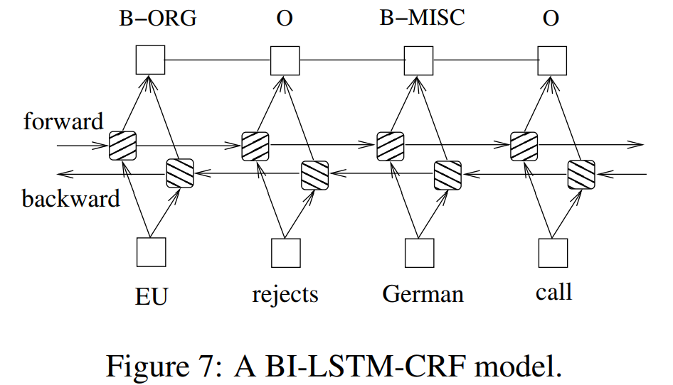

# Chinese Sentiment Classification

## Files

```
├── Dataset
│   ├── test.txt
│   ├── train.txt
│   ├── validation.txt
│   └── wiki_word2vec_50.bin
├── img       [images]
├── model     [put your models here]
├── models.py
├── test.py
├── train.py
└── README.md
```

- `Dataset`文件夹包含训练集、验证集、测试集以及经预训练的词向量文件
- `model`文件夹包含已训练好的模型
- `models.py`定义了模型结构
- `test.py`定义了测试函数
- `train.py`定义了训练函数

## Usage

1. Install dependencies: cuda is required too.
   
   ```
   pip install -r requirements.txt
   ```

2. Run `train.py` to train the models
   Script：`python train.py --model <model_name> --epoch <epoch_num> --msg <message>`

Params：

- `model_name`：模型名称，可选`cnn`、`rnn`、`rnn2`、`mlp`

- `epoch_num`：训练轮数

- `message`：训练信息，用于区分不同训练记录
3. Run`test.py` to start tests on models
   Script：`python test.py --model <model_name> --path <model_path>`

Params：

- `model_name`：模型名称，可选`cnn`、`rnn`、`rnn2`、`mlp`
- `model_path`：模型路径

## Model Structures

- CNN：Convolutional Neural Networks
  
  Reference: [Convolutional Neural Networks for Sentence Classification](https://arxiv.org/pdf/1408.5882)
  
  

- RNN：LSTM model

- RNN2：Bi-LSTM model
  
  Reference: [Bidirectional LSTM-CRF Models for Sequence Tagging](https://arxiv.org/pdf/1508.01991)
  
  
  
  

- MLP：MultiLayer Perceptron

选取的Criterion为`nn.BCEWithLogitsLoss()`，optimizer设置为`torch.optim.Adam(model.parameters(), lr=model.lr, weight_decay=1e-6)`，scheduler为`ExponentialLR`，以指数衰减减少过拟合风险。


